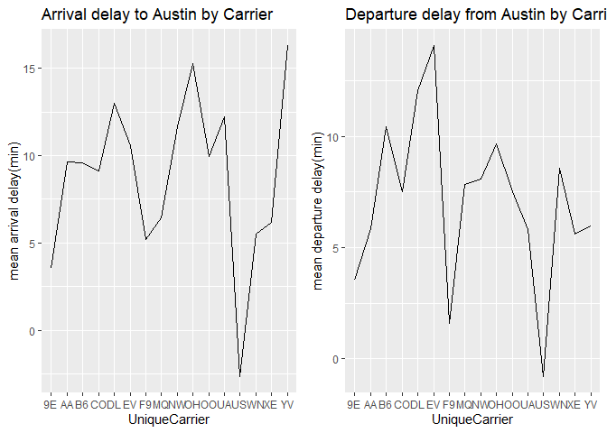
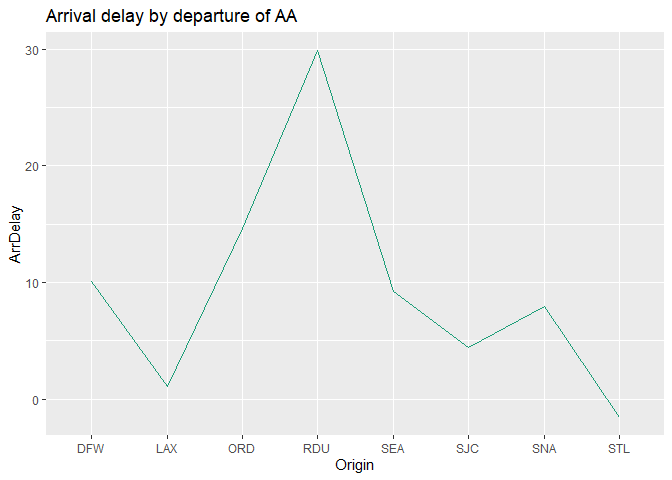

# Visual story telling part 1: green buildings

To begin with the analysis, we first processed and cleaned the data by
making categorical variables to factors, dropped missing data, and
combined certain variables into one to make analysis convenient.

Also, I created a new variable, ‘total rent’, by taking the product of
rent, leasing_rate, and size. In order to validate the stats guru’s
claim, we separated the data into green and non-green buildings, and we
calculated the mean Rent and mean total rent for both subsets.

    ## mean rent for green buildings =  29.97415
    ## mean rent for non-green buildings =  28.27323
    ## difference between mean rent of green buildings and non-green builings = 1.70092
    
    ## mean total rent for green buildings =  8746220
    ## mean total rent for non-green buildings =  6334522
    ## difference between mean total rent of green buildings and non-green builings = 2411698


    Green building's Rent is higher than normal buildings in average and in total.

Next, we proceed to verify if green rating is what causes the increase
in rent. First, we fit a linear model using most variables to identify
significant predictors for green and normal buildings.

    ## 
    ## Call:
    ## lm(formula = Rent ~ size + empl_gr + leasing_rate + stories + 
    ##     age + renovated + net + amenities + total_dd_07 + Precipitation + 
    ##     Gas_Costs + Electricity_Costs + class, data = green)
    ## 
    ## Residuals:
    ##     Min      1Q  Median      3Q     Max 
    ## -23.726  -6.275  -1.775   4.569  89.250 
    ## 
    ## Coefficients:
    ##                     Estimate Std. Error t value Pr(>|t|)    
    ## (Intercept)        4.726e+00  6.610e+00   0.715  0.47488    
    ## size               3.869e-06  3.958e-06   0.978  0.32859    
    ## empl_gr            2.721e-01  5.403e-02   5.036 6.13e-07 ***
    ## leasing_rate       1.030e-01  3.541e-02   2.909  0.00375 ** 
    ## stories           -3.736e-02  8.584e-02  -0.435  0.66355    
    ## age                8.905e-02  3.351e-02   2.657  0.00807 ** 
    ## renovated1        -1.190e+00  1.175e+00  -1.013  0.31136    
    ## net1              -3.145e+00  1.883e+00  -1.670  0.09536 .  
    ## amenities1        -1.164e+00  1.075e+00  -1.082  0.27957    
    ## total_dd_07       -1.512e-03  3.690e-04  -4.097 4.70e-05 ***
    ## Precipitation      3.264e-01  6.580e-02   4.960 8.97e-07 ***
    ## Gas_Costs         -1.451e+03  3.363e+02  -4.314 1.84e-05 ***
    ## Electricity_Costs  5.906e+02  9.218e+01   6.407 2.81e-10 ***
    ## class2             3.208e+00  4.405e+00   0.728  0.46667    
    ## class3             9.181e+00  4.421e+00   2.077  0.03820 *  
    ## ---
    ## Signif. codes:  0 '***' 0.001 '**' 0.01 '*' 0.05 '.' 0.1 ' ' 1
    ## 
    ## Residual standard error: 11.13 on 664 degrees of freedom
    ## Multiple R-squared:  0.2733, Adjusted R-squared:  0.258 
    ## F-statistic: 17.84 on 14 and 664 DF,  p-value: < 2.2e-16

    empl_gr, leasing_rate, age,total_dd, precipitation, Gas_costs, Electricity_cost are significant predictors for green building rents. 

To visualize the individual effects of these significant predictors on
Rent of green buildings and their correlations, we created a correlation
plot, scatter plots, and box plots below:


By neglecting the outliers, we discovered most of these variables were
significant to the increase of green building’s rent. Then, we compared
some of the variables of green buildings to those of normal buildings:

Let’s start with age comparison:

    ##    Min. 1st Qu.  Median    Mean 3rd Qu.    Max. 
    ##    0.00   -6.00  -14.00  -25.41  -54.00  -55.00


We discovered that green builidings in general were newer, which leads
to higher rent.


``` r
summary(green$class)-summary(normal$class)
```

    ##     1     2     3 
    ## -1093 -3330 -2039

``` r
round(table(green$class)/sum(table(green$class)),2)
```

    ## 
    ##    1    2    3 
    ## 0.01 0.19 0.80

``` r
round(table(normal$class)/sum(table(normal$class)),2)
```

    ## 
    ##    1    2    3 
    ## 0.15 0.48 0.36

Most of the green buildings are in class A(= class score: 3 in our
definition). This fact leads us to believe that green buildings are
generally with higher quality compared to non-green buildings.

In conclusion, age and class could be the reason why green buildings
were higher in rent instead of being rated as green buildings. As a
result, we will recommend the developer to make build the new 15-story
mixed-use building based on class A requirements.

# Visual story telling part 2: flights at ABIA

We first created a new ‘Date’ column by combining ‘Year’, ‘Month’, and
‘Day of Month’. We also converted the time-related columns(DepTime,
CRSDepTime, ArrTime, CRSArrTime) into time formats(HH:MM) for convenient
analysis.

Let’s start from seeing the flight frequency by different scales of
time:


We can see that Winter generally had much fewer flights than Summer.
This is understandable as people usually have vacations in the Summer.
Moreover, the pattern of flight frequency by day of month looked similar
in each month. On average, there were 4 to 5 drops in each month. We
could guess this was because there was usually fewer flights in a
specific day of week. The third plot actually made us realize that
generally there ware fewer flights on Saturday(the sixth day of week).


We can see that ABIA Airport were mainly dominated by Southwest
Airlines(WN), while American Airlines(AA) and Continental Airlines(CO)
being the Top 2 and Top 3 airlines.

Let’s try to dig more information of the Top 3 airlines:

To find insights with arrival or departure respectively, we separated
the original full data into two data sets: one with all the flights flew
to Austin and another one with all the flights departured from Austin.


We can see that the the performance of average delay rate of the Top 3
Airlines was medium among all airlines at ABIA airport. Southwest
Airlines actually did quite well on on-time arrivals. With more than
15,000 flights arriving at Austin, Southwest Airlines only had averagely
5-min delay.


By looking into monthly arrival and departure delay of the Top 3
airline, we came to realize that the season from September to November
generally had low delay rate while March, June and December had high
delay rate.





From the above plots, we can know the these three airlines did not have
same flight routes.  
For Southwest Airlines, flights from Nashville International
Airport(BNA) generally had longest average of arrival delay.
Surprisingly, flights from Las Vegas Airport(LAS) and Orlando
International Airport(OIA) usually arrived earlier than the scheduled
time.  
For American Airlines, most of the arrival delay are caused by flights
that flied from Raleigh–Durham International Airport(RDU) in North
Carolina, with average arrival delay at 30 minutes.  
For Continental Airlines, there were only two routes. The route from
Newark Liberty International Airport(EWR) had more than twice delay time
than that from George Bush Intercontinental Airport(IAH). As IAH is also
located in Texas, the distance can be the factor of the delay.

# Portfolio modeling

We constructed three different portfolios of ETFs and used bootstrap
resampling to estimate the 4-week (20 trading day) value at risk of each
of three portfolios at the 5% level.

We selected 4 ETFs and invested respectively with different portion of
money to be our 3 portfolios. The category of three portfolios is: Save,
High Risk and Combined. We considered the date starting from 01-Jan-2015

-   Save portfolios: VOO (45%), DIA (45%), TNA (5%), FAS (5%)
-   High risk portfolio: TNA (45%), FAS (45%), VOO (5%), DIA (5%)
-   Combined: VOO (25%), DIA (25%), TNA (25%), FAS (25%)

Brief introduction to our selection: \* DIA, VOO are three of the safest
and largest ETF. \* FAS (Direxion Daily Financial Bull 3X shares): it
delivers three time the losses when things lurch to the downside. As the
pandemic wore down many local economics, this leveraged ETF took a
massive hit and remains down about 50% year to date in 2020. \* TNA
(Direxion Daily Small Cap Bull 3X Shares): with a smaller overall market
that small companies are naturally more volatile.

#### Volatility of the ETFs across the 6-year period:

    ## [1] "DIA" "VOO" "TNA" "FAS"


    ##               ClCl.DIAa    ClCl.VOOa   ClCl.TNAa   ClCl.FASa
    ## 2015-01-02           NA           NA          NA          NA
    ## 2015-01-05 -0.017421636 -0.017568992 -0.03833108 -0.05684491
    ## 2015-01-06 -0.008293280 -0.009833011 -0.05423411 -0.03932167
    ## 2015-01-07  0.012688142  0.012495193  0.03634100  0.03392184
    ## 2015-01-08  0.018053415  0.017568490  0.05000000  0.04343820
    ## 2015-01-09 -0.008614869 -0.008420776 -0.02653963 -0.03473172


#### 1st Portfolio: Safe

Initial wealth: $100,000

We distributed our 90% of the total wealth to DIA and VOO, 10% to TNA
and FAS.

    ##            ClCl.DIAa ClCl.VOOa ClCl.TNAa ClCl.FASa
    ## 2017-03-16  44969.94   44924.1   5029.35   5036.55

    ## [1] 99959.94

    ## [1] 124629.9


    ##               [,1]      [,2]      [,3]      [,4]     [,5]     [,6]      [,7]
    ## result.1  99716.48  95742.75  97216.26  98174.16 100309.6 100164.0  99727.83
    ## result.2  99176.41  98633.87  99471.09 100518.75 101484.1 102163.5 102537.86
    ## result.3  99457.01 101090.17 102094.75 102047.26 102899.7 102366.5 102035.35
    ## result.4  97835.96  97715.03  98466.61 100700.42 101085.4 101050.6 101311.04
    ## result.5 100257.63 100797.85 101485.35  99947.24 100417.9 105876.3 107095.35
    ## result.6 100870.80 102229.87 102320.61 102968.42 100167.6 100313.4 100001.93
    ##               [,8]      [,9]     [,10]    [,11]    [,12]    [,13]    [,14]
    ## result.1 101193.25 100751.84 101212.31 101305.7 101088.2 101274.3 101500.2
    ## result.2 104092.31 105094.18 105061.51 104534.1 105270.9 104908.6 104932.8
    ## result.3 102508.36 102563.71 102175.07 102939.2 102998.6 105016.6 104557.3
    ## result.4 101826.45 102182.51 102016.47 102811.9 102869.9 103057.5 102581.4
    ## result.5 105823.64 107338.02 105864.28 106565.5 104922.5 105965.1 106306.6
    ## result.6  99995.85  99567.64  99668.38 102197.1 104668.4 104179.0 103659.2
    ##             [,15]    [,16]    [,17]    [,18]    [,19]    [,20]
    ## result.1 100110.5 102661.5 103295.0 103841.5 104646.3 104609.0
    ## result.2 106191.3 105974.4 102951.1 102651.0 102818.8 102537.5
    ## result.3 105702.4 107408.6 109358.5 109294.7 107737.3 103503.9
    ## result.4 102114.3 101802.3 101056.6 103207.4 104630.2 104404.1
    ## result.5 105308.4 104983.5 103513.9 104636.0 104478.6 105102.7
    ## result.6 104010.9 103140.6 101791.9 101369.0 101163.3 101639.5


    ## [1] 101419.9

    ## [1] 1419.862


    ##        5% 
    ## -9501.304

Summary - safe portfolio: \* Average return of investment after 20 days:
101791.8 \* 5% value at Risk for safe portfolio: -8828.842

#### 2nd Portfolio: High-risk

The initial wealth is $100,000

We distributed our 90% of the total wealth to TNA and FAS, 10% to DIA
and VOO

    ##            ClCl.DIAa ClCl.VOOa ClCl.TNAa ClCl.FASa
    ## 2015-03-11  4990.379  4988.297  45879.84  45639.67

    ## [1] 101498.2

    ## [1] 97390.9


    ##               [,1]      [,2]      [,3]      [,4]      [,5]      [,6]      [,7]
    ## result.1  99451.56  99060.20 100327.35  98769.30  97395.42  98523.38 101444.22
    ## result.2 100154.71  98171.78  96005.39  99736.55  95801.76  96647.84  95685.42
    ## result.3 100979.21 105678.33 105590.37 100754.77  96979.77  96520.59  96396.52
    ## result.4 100050.84  97754.33  99095.69  99552.41  97907.56  97919.24  97309.09
    ## result.5 101831.75 102588.73 101954.00  96629.96  97761.98  97817.78  98809.24
    ## result.6  99959.19 101660.17 105438.48 107451.60 108788.70 117024.25 119154.32
    ##               [,8]      [,9]     [,10]     [,11]     [,12]     [,13]     [,14]
    ## result.1 102224.61 100324.18 108751.78 107877.97 107558.00 103436.36 103859.02
    ## result.2  96571.08  97018.48  98004.99 100490.20 101363.09  98687.57 100018.92
    ## result.3  95208.52  96157.46  96786.16  97920.14  99905.56 103457.04 101980.79
    ## result.4 101291.46 101460.53 104584.44 103513.90 102413.97 107498.28 106471.42
    ## result.5  98186.94  94386.42  96955.32  99995.24 100765.60  96110.56  94700.53
    ## result.6 120091.86 122006.97 114056.54 114123.03 117658.22 104073.92 105549.64
    ##              [,15]     [,16]     [,17]     [,18]     [,19]     [,20]
    ## result.1 103089.03  95701.66  98699.05  97931.29  97717.30  97208.40
    ## result.2  99064.33 100594.88 100112.72 101374.31 102988.30 101226.16
    ## result.3 102742.83 109727.03 109238.79 110248.00 114335.55 116960.71
    ## result.4 106726.97 110435.33 112084.30 120427.95 120480.68 122882.63
    ## result.5  93711.66  93502.64  91537.55  92414.48  93577.84  94824.85
    ## result.6  88020.37  87847.96  87374.26  90231.20  90719.76  95203.81


    ## [1] 104990.2

    ## [1] 4990.199


    ##        5% 
    ## -24333.09

Summary - high-risk portfolio: \* Average return of investment after 20
days: 105411.8 \* 5% value at Risk for high-risk portfolio: -23499.82

#### 3rd Portfolio: Combined

The initial wealth is $100,000

We distributed our 50% of the total wealth to TNA and FAS, 50% to DIA
and VOO

    ##            ClCl.DIAa ClCl.VOOa ClCl.TNAa ClCl.FASa
    ## 2017-11-09  24921.43  24909.68  24700.31   24800.1

    ## [1] 99331.52

    ## [1] 105772.6


    ##               [,1]      [,2]      [,3]      [,4]      [,5]      [,6]      [,7]
    ## result.1 100002.99  94132.79  93951.32  96684.38  99103.70  97661.31  95732.98
    ## result.2  99881.90 101305.73 100886.61  99591.53 100165.79 103110.09 103206.75
    ## result.3  99984.82  99219.91 100596.15 101328.97 102728.78 102840.40  98369.97
    ## result.4 101091.21 100151.03 100826.47 101083.03 102533.44 102614.70 103059.83
    ## result.5  99887.35  93853.60  95157.92  95861.15  92810.91  92152.47  93576.01
    ## result.6 100828.43 100969.10 101645.99 102464.29 102707.51 100903.52  99734.85
    ##               [,8]      [,9]     [,10]     [,11]     [,12]     [,13]     [,14]
    ## result.1  98934.71  98106.23  98073.95  98114.63 102516.96 100851.23 100421.76
    ## result.2 102613.86 104888.45 105557.63 106788.84 107301.35 108449.59 108545.19
    ## result.3  98297.38  96157.31  96693.34  95927.09  98511.41 100054.80  99950.33
    ## result.4 110150.30 110004.54 109694.22 108984.40 112741.72 111231.21 112489.01
    ## result.5  96062.18  96987.68  97239.67  97851.75 101277.06 101490.77 101521.88
    ## result.6  98031.51  98262.82  98043.09  91592.39  94340.33  96614.95  95688.42
    ##              [,15]     [,16]     [,17]    [,18]     [,19]     [,20]
    ## result.1  98558.06 101823.60 104011.31 104422.8 104703.40 102830.11
    ## result.2 107977.38 107069.49 107644.68 103815.5 103069.61 103558.25
    ## result.3 102468.55 105548.64 105706.51 105852.5 108192.22 107182.28
    ## result.4 110431.46 111657.77 111370.36 107326.5 105480.83 102570.55
    ## result.5 101598.45  97621.32  96641.21  95178.3  94215.06  87252.79
    ## result.6  95939.58  97166.80  98913.01  99472.8 102967.88  97754.68


``` r
# Profit/loss
mean(sim1[,n_days])
```

    ## [1] 103317.2

``` r
mean(sim1[,n_days] - initial_wealth)
```

    ## [1] 3317.155

``` r
hist(sim1[,n_days]- initial_wealth, breaks=30)
```


``` r
# 5% value at risk:
quantile(sim1[,n_days]- initial_wealth, prob=0.05)
```

    ##        5% 
    ## -16469.17

Summary - combined portfolio: \* Average return of investment after 20
days: 103723.9 \* 5% value at Risk for combined portfolio: -16008.71

#### Conclusion

We can discover that the safe portfolio has the lowest 5% VaR, the
high-risk portfolio has the highest 5% VaR, and the combined portfolio
performed between the two portfolios. Moreover, we can obviously notice
that the risk portfolio had more dramatic fluctuation.

# Market segmentation

``` r
library(readr)
library(tibble)
social1 = read_csv(url("https://raw.githubusercontent.com/jgscott/STA380/master/data/social_marketing.csv"))
```

    ## Warning: Missing column names filled in: 'X1' [1]

    ## 
    ## -- Column specification --------------------------------------------------------
    ## cols(
    ##   .default = col_double(),
    ##   X1 = col_character()
    ## )
    ## i Use `spec()` for the full column specifications.

``` r
social1 = data.frame(social1)
social <- social1[-1]
row.names(social) <- social1$X1

social_results = social1 %>% group_by(X1) %>% summarize_all(mean) %>%
  column_to_rownames(var="X1")

  #variables correlation plot
cor(social_results)
```

    ##                       chatter current_events       travel photo_sharing
    ## chatter           1.000000000    0.156211163  0.014666814   0.536266603
    ## current_events    0.156211163    1.000000000  0.050946163   0.145952862
    ## travel            0.014666814    0.050946163  1.000000000   0.024067950
    ## photo_sharing     0.536266603    0.145952862  0.024067950   1.000000000
    ## uncategorized     0.066993440    0.029674226  0.030865562   0.096398099
    ## tv_film           0.012898633    0.077673464  0.096989954   0.021170912
    ## sports_fandom     0.014392631    0.061780370 -0.008709190   0.019921002
    ## politics          0.051448378    0.068282733  0.660210000   0.039766998
    ## food             -0.004704080    0.059767526  0.075142216   0.006802181
    ## family            0.079170381    0.063367006  0.017534763   0.098587939
    ## home_and_garden   0.070157596    0.053511465  0.040931872   0.083955114
    ## music             0.091317767    0.072366139  0.038640317   0.146188166
    ## news             -0.001163561    0.060284226  0.250616947  -0.011980028
    ## online_gaming     0.004784789   -0.001645689  0.013222873   0.037234010
    ## shopping          0.583373219    0.150143619  0.019907780   0.535621020
    ## health_nutrition  0.003727738    0.019863015 -0.011922499   0.034804791
    ## college_uni       0.033991439    0.030952662  0.053835136   0.061494841
    ## sports_playing    0.061073951    0.030720781  0.054961948   0.098696993
    ## cooking           0.002081642    0.046716479  0.017597488   0.360590994
    ## eco               0.155117735    0.076903468  0.061434287   0.173411683
    ## computers         0.072489571    0.054824859  0.602934879   0.093000186
    ## business          0.166106904    0.074580868  0.161845668   0.178636351
    ## outdoors         -0.006597319    0.017898948  0.027133231   0.032783874
    ## crafts            0.111741452    0.073723629  0.086953794   0.110945709
    ## automotive        0.133767354    0.072444806 -0.002784110   0.115249028
    ## art              -0.005076772    0.053477246  0.086394257   0.024752344
    ## religion         -0.023111699    0.067694509  0.063933064   0.003299888
    ## beauty            0.026364231    0.070112215  0.012565524   0.317965902
    ## parenting         0.020742516    0.050237162  0.042341130   0.041169648
    ## dating            0.184452453    0.031045863  0.086756030   0.028511721
    ## school            0.116678625    0.068047127  0.022199544   0.106209238
    ## personal_fitness  0.032747707    0.038388654 -0.005299245   0.062523682
    ## fashion           0.063314293    0.055906219  0.026015648   0.347248795
    ## small_business    0.116730623    0.065497930  0.116950707   0.138112387
    ## spam              0.004603242    0.019402989  0.022773349  -0.008664858
    ## adult             0.015372712    0.016764279  0.020244743  -0.012707084
    ##                  uncategorized       tv_film sports_fandom     politics
    ## chatter           0.0669934396  0.0128986328  0.0143926306  0.051448378
    ## current_events    0.0296742259  0.0776734640  0.0617803698  0.068282733
    ## travel            0.0308655618  0.0969899543 -0.0087091896  0.660210000
    ## photo_sharing     0.0963980989  0.0211709116  0.0199210022  0.039766998
    ## uncategorized     1.0000000000  0.1632789878 -0.0005287314 -0.001143143
    ## tv_film           0.1632789878  1.0000000000  0.0307587998  0.032254541
    ## sports_fandom    -0.0005287314  0.0307587998  1.0000000000  0.067097905
    ## politics         -0.0011431434  0.0322545409  0.0670979049  1.000000000
    ## food              0.0353476665  0.0806833248  0.5326383665  0.059017379
    ## family           -0.0046281840  0.0217763915  0.4378103823  0.045470650
    ## home_and_garden   0.0742591369  0.1065910522  0.0848219920  0.057986105
    ## music             0.1439077049  0.2748322309  0.0545375138  0.007545661
    ## news              0.0037403342  0.0674405581  0.2002896757  0.561842213
    ## online_gaming     0.0236016809  0.0353318018  0.0247608769 -0.006917410
    ## shopping          0.0553125510  0.0416246434  0.0262612699  0.046393973
    ## health_nutrition  0.0798559719 -0.0017906843 -0.0112292550 -0.016851900
    ## college_uni       0.0947186290  0.2042182554  0.0264564138  0.008964787
    ## sports_playing    0.0838301172  0.1032631811  0.0710499117  0.032736511
    ## cooking           0.1612570088  0.0006017955  0.0076921174 -0.007322368
    ## eco               0.0472320334  0.0628254703  0.0858508297  0.064256293
    ## computers         0.0266392164 -0.0054859445  0.0506332951  0.572150641
    ## business          0.0659654221  0.1011473763  0.0681327694  0.150675278
    ## outdoors          0.0939022767  0.0289285413  0.0622176473  0.073373236
    ## crafts            0.0891965709  0.1846894463  0.2011885972  0.058597842
    ## automotive        0.0139164228  0.0205075271  0.2396464725  0.285508994
    ## art               0.1064475118  0.4987718266  0.0223195336  0.025625587
    ## religion          0.0170384882  0.0450275641  0.6379748428  0.032529266
    ## beauty            0.1373705347  0.0167831053  0.1228632403 -0.011292710
    ## parenting         0.0062680638 -0.0017880905  0.6077181198  0.044281427
    ## dating            0.1270238084  0.0041708935  0.0169255299  0.078288457
    ## school            0.0582599351  0.0250222744  0.4931061924  0.027795499
    ## personal_fitness  0.0847295855 -0.0004447435  0.0142720768 -0.008096476
    ## fashion           0.1414087167  0.0176088683  0.0307672871 -0.006793131
    ## small_business    0.0848320319  0.1887982408  0.0486622355  0.105261525
    ## spam              0.0138980529 -0.0042106462  0.0089574643  0.009438922
    ## adult             0.0451966858 -0.0217002490  0.0079861641 -0.027102370
    ##                          food       family home_and_garden         music
    ## chatter          -0.004704080  0.079170381      0.07015760  0.0913177669
    ## current_events    0.059767526  0.063367006      0.05351146  0.0723661388
    ## travel            0.075142216  0.017534763      0.04093187  0.0386403172
    ## photo_sharing     0.006802181  0.098587939      0.08395511  0.1461881658
    ## uncategorized     0.035347667 -0.004628184      0.07425914  0.1439077049
    ## tv_film           0.080683325  0.021776392      0.10659105  0.2748322309
    ## sports_fandom     0.532638366  0.437810382      0.08482199  0.0545375138
    ## politics          0.059017379  0.045470650      0.05798610  0.0075456607
    ## food              1.000000000  0.375533627      0.08921731  0.0721457958
    ## family            0.375533627  1.000000000      0.06504292  0.0351173712
    ## home_and_garden   0.089217308  0.065042916      1.00000000  0.0632560502
    ## music             0.072145796  0.035117371      0.06325605  1.0000000000
    ## news              0.064499690  0.094370314      0.08137338  0.0155152209
    ## online_gaming     0.045756746  0.082462535      0.03037615  0.0234658858
    ## shopping          0.020982946  0.084098539      0.07322790  0.1059920572
    ## health_nutrition  0.223043246  0.026603921      0.06612165  0.0512084191
    ## college_uni       0.048260040  0.068586525      0.06022031  0.1881590868
    ## sports_playing    0.089333676  0.099209710      0.06847339  0.1080771385
    ## cooking           0.067684449  0.055368653      0.07302935  0.1699371547
    ## eco               0.148171958  0.085396673      0.07238756  0.0699570243
    ## computers         0.112482997  0.062071539      0.05303950  0.0425994678
    ## business          0.076995867  0.063453202      0.04751696  0.1024759787
    ## outdoors          0.190841529  0.057691067      0.07788630  0.0871445544
    ## crafts            0.238647962  0.171104760      0.07652389  0.0778324671
    ## automotive        0.059687427  0.149865803      0.07189290  0.0297480759
    ## art               0.101791832  0.030163186      0.10488798  0.0202095405
    ## religion          0.591318063  0.452768549      0.09439831  0.0753480995
    ## beauty            0.102454336  0.118087188      0.07316316  0.1769706252
    ## parenting         0.544948125  0.420578018      0.08011189  0.0440734267
    ## dating            0.033434336  0.017710590      0.10761722  0.0098874584
    ## school            0.432403928  0.334689575      0.10006929  0.0518095525
    ## personal_fitness  0.223856925  0.038185942      0.07695813  0.0513248587
    ## fashion           0.036963917  0.062704099      0.07612052  0.1604436447
    ## small_business    0.063499437  0.062871670      0.08015803  0.1220162157
    ## spam              0.001482766 -0.006802752      0.02160085  0.0005284301
    ## adult             0.017630551  0.034583067      0.03939379 -0.0042387481
    ##                          news online_gaming     shopping health_nutrition
    ## chatter          -0.001163561  0.0047847889  0.583373219     0.0037277381
    ## current_events    0.060284226 -0.0016456887  0.150143619     0.0198630146
    ## travel            0.250616947  0.0132228733  0.019907780    -0.0119224993
    ## photo_sharing    -0.011980028  0.0372340099  0.535621020     0.0348047911
    ## uncategorized     0.003740334  0.0236016809  0.055312551     0.0798559719
    ## tv_film           0.067440558  0.0353318018  0.041624643    -0.0017906843
    ## sports_fandom     0.200289676  0.0247608769  0.026261270    -0.0112292550
    ## politics          0.561842213 -0.0069174099  0.046393973    -0.0168519001
    ## food              0.064499690  0.0457567463  0.020982946     0.2230432459
    ## family            0.094370314  0.0824625354  0.084098539     0.0266039206
    ## home_and_garden   0.081373376  0.0303761455  0.073227895     0.0661216523
    ## music             0.015515221  0.0234658858  0.105992057     0.0512084191
    ## news              1.000000000 -0.0023217561 -0.011813142     0.0184723484
    ## online_gaming    -0.002321756  1.0000000000 -0.007932408    -0.0000176422
    ## shopping         -0.011813142 -0.0079324080  1.000000000     0.0314086858
    ## health_nutrition  0.018472348 -0.0000176422  0.031408686     1.0000000000
    ## college_uni      -0.006632975  0.7728392923  0.029046828    -0.0277788561
    ## sports_playing    0.037554057  0.4912993420  0.039791700     0.0447899666
    ## cooking           0.013169882  0.0353209993  0.086908714     0.2489527151
    ## eco               0.039161408  0.0275257081  0.165475294     0.2208463589
    ## computers         0.211780215  0.0142759909  0.069347702     0.0235923180
    ## business          0.052022707  0.0032965473  0.160388318     0.0330434015
    ## outdoors          0.140731385  0.0056496732  0.018558832     0.6082253668
    ## crafts            0.053261774  0.0417262775  0.107245497     0.0797254552
    ## automotive        0.555417450  0.0483166936  0.115744356    -0.0238249985
    ## art               0.041357011  0.0828918943  0.032911113     0.0319408677
    ## religion          0.022945910  0.0057441594  0.007956775     0.0106622133
    ## beauty            0.017223284  0.0045270085  0.068034649     0.0069553398
    ## parenting         0.078897406  0.0226973412  0.020248306     0.0292332391
    ## dating            0.052065729  0.0228324583  0.004068363     0.0751908487
    ## school            0.052728222 -0.0008595235  0.076918012     0.0066410255
    ## personal_fitness  0.028739368  0.0119043235  0.054419081     0.8099023568
    ## fashion           0.002132337  0.0360133351  0.096854665     0.0297479557
    ## small_business    0.047598846  0.0419629288  0.112662828    -0.0093025415
    ## spam             -0.001800012  0.0058670252 -0.019251616     0.0023958243
    ## adult            -0.011204031  0.0125787755 -0.017128756    -0.0090925481
    ##                    college_uni sports_playing       cooking        eco
    ## chatter           0.0339914391    0.061073951  0.0020816423 0.15511774
    ## current_events    0.0309526621    0.030720781  0.0467164788 0.07690347
    ## travel            0.0538351360    0.054961948  0.0175974884 0.06143429
    ## photo_sharing     0.0614948410    0.098696993  0.3605909943 0.17341168
    ## uncategorized     0.0947186290    0.083830117  0.1612570088 0.04723203
    ## tv_film           0.2042182554    0.103263181  0.0006017955 0.06282547
    ## sports_fandom     0.0264564138    0.071049912  0.0076921174 0.08585083
    ## politics          0.0089647874    0.032736511 -0.0073223677 0.06425629
    ## food              0.0482600403    0.089333676  0.0676844485 0.14817196
    ## family            0.0685865247    0.099209710  0.0553686528 0.08539667
    ## home_and_garden   0.0602203114    0.068473391  0.0730293453 0.07238756
    ## music             0.1881590868    0.108077138  0.1699371547 0.06995702
    ## news             -0.0066329747    0.037554057  0.0131698817 0.03916141
    ## online_gaming     0.7728392923    0.491299342  0.0353209993 0.02752571
    ## shopping          0.0290468283    0.039791700  0.0869087138 0.16547529
    ## health_nutrition -0.0277788561    0.044789967  0.2489527151 0.22084636
    ## college_uni       1.0000000000    0.506374768  0.0326211357 0.02999765
    ## sports_playing    0.5063747684    1.000000000  0.1134243174 0.04883664
    ## cooking           0.0326211357    0.113424317  1.0000000000 0.09468926
    ## eco               0.0299976539    0.048836643  0.0946892641 1.00000000
    ## computers         0.0357173059    0.055137058  0.0625767717 0.07170567
    ## business          0.0568632385    0.058557218  0.0904536300 0.06903281
    ## outdoors          0.0002266462    0.058386618  0.1926335927 0.17481079
    ## crafts            0.0445461695    0.073583667  0.0683961801 0.08596322
    ## automotive        0.0392353381    0.046380642  0.0195136512 0.05997131
    ## art               0.0903808391    0.056542328  0.0555088964 0.06668392
    ## religion          0.0278312665    0.076103199  0.0339513209 0.09915385
    ## beauty            0.0196241668    0.093295239  0.6642389459 0.04762071
    ## parenting         0.0103665861    0.068607722  0.0506783916 0.11429246
    ## dating            0.0240141334    0.094629504  0.0290986583 0.06553289
    ## school           -0.0055988726    0.067138279  0.0843002915 0.09004071
    ## personal_fitness -0.0215268678    0.051434835  0.2336229315 0.21261355
    ## fashion           0.0520235384    0.108221244  0.7214026744 0.06381744
    ## small_business    0.1138833315    0.079653227  0.0727561881 0.07650412
    ## spam              0.0094529848   -0.008742556 -0.0061781291 0.03141528
    ## adult            -0.0117086302   -0.011257322 -0.0045564273 0.06021275
    ##                     computers     business      outdoors     crafts
    ## chatter           0.072489571  0.166106904 -0.0065973195 0.11174145
    ## current_events    0.054824859  0.074580868  0.0178989481 0.07372363
    ## travel            0.602934879  0.161845668  0.0271332314 0.08695379
    ## photo_sharing     0.093000186  0.178636351  0.0327838735 0.11094571
    ## uncategorized     0.026639216  0.065965422  0.0939022767 0.08919657
    ## tv_film          -0.005485945  0.101147376  0.0289285413 0.18468945
    ## sports_fandom     0.050633295  0.068132769  0.0622176473 0.20118860
    ## politics          0.572150641  0.150675278  0.0733732362 0.05859784
    ## food              0.112482997  0.076995867  0.1908415291 0.23864796
    ## family            0.062071539  0.063453202  0.0576910670 0.17110476
    ## home_and_garden   0.053039498  0.047516956  0.0778863049 0.07652389
    ## music             0.042599468  0.102475979  0.0871445544 0.07783247
    ## news              0.211780215  0.052022707  0.1407313846 0.05326177
    ## online_gaming     0.014275991  0.003296547  0.0056496732 0.04172628
    ## shopping          0.069347702  0.160388318  0.0185588318 0.10724550
    ## health_nutrition  0.023592318  0.033043402  0.6082253668 0.07972546
    ## college_uni       0.035717306  0.056863238  0.0002266462 0.04454617
    ## sports_playing    0.055137058  0.058557218  0.0583866177 0.07358367
    ## cooking           0.062576772  0.090453630  0.1926335927 0.06839618
    ## eco               0.071705671  0.069032814  0.1748107912 0.08596322
    ## computers         1.000000000  0.145387107  0.0430388875 0.09283321
    ## business          0.145387107  1.000000000  0.0509135858 0.10165359
    ## outdoors          0.043038887  0.050913586  1.0000000000 0.07239357
    ## crafts            0.092833206  0.101653592  0.0723935740 1.00000000
    ## automotive        0.013813021  0.040319930  0.0887386055 0.03397123
    ## art              -0.003641485  0.085921419  0.0069278190 0.23353456
    ## religion          0.107529163  0.075390623  0.0426490984 0.23640037
    ## beauty            0.050833394  0.087306971  0.0414714063 0.09871424
    ## parenting         0.092961564  0.083133411  0.0613567343 0.20838376
    ## dating            0.094839229  0.111825266  0.0953960198 0.09845243
    ## school            0.076726075  0.104868599  0.0428262486 0.21799280
    ## personal_fitness  0.021830496  0.058177210  0.5677902744 0.09075479
    ## fashion           0.063047239  0.109494748  0.0557789123 0.08554645
    ## small_business    0.104650495  0.107021298  0.0081708055 0.09108434
    ## spam              0.023117451 -0.025491850  0.0215189501 0.01993976
    ## adult             0.030290997 -0.010963774  0.0710361684 0.03101611
    ##                    automotive          art     religion       beauty
    ## chatter           0.133767354 -0.005076772 -0.023111699  0.026364231
    ## current_events    0.072444806  0.053477246  0.067694509  0.070112215
    ## travel           -0.002784110  0.086394257  0.063933064  0.012565524
    ## photo_sharing     0.115249028  0.024752344  0.003299888  0.317965902
    ## uncategorized     0.013916423  0.106447512  0.017038488  0.137370535
    ## tv_film           0.020507527  0.498771827  0.045027564  0.016783105
    ## sports_fandom     0.239646473  0.022319534  0.637974843  0.122863240
    ## politics          0.285508994  0.025625587  0.032529266 -0.011292710
    ## food              0.059687427  0.101791832  0.591318063  0.102454336
    ## family            0.149865803  0.030163186  0.452768549  0.118087188
    ## home_and_garden   0.071892898  0.104887976  0.094398311  0.073163163
    ## music             0.029748076  0.020209541  0.075348099  0.176970625
    ## news              0.555417450  0.041357011  0.022945910  0.017223284
    ## online_gaming     0.048316694  0.082891894  0.005744159  0.004527009
    ## shopping          0.115744356  0.032911113  0.007956775  0.068034649
    ## health_nutrition -0.023824999  0.031940868  0.010662213  0.006955340
    ## college_uni       0.039235338  0.090380839  0.027831267  0.019624167
    ## sports_playing    0.046380642  0.056542328  0.076103199  0.093295239
    ## cooking           0.019513651  0.055508896  0.033951321  0.664238946
    ## eco               0.059971307  0.066683922  0.099153848  0.047620711
    ## computers         0.013813021 -0.003641485  0.107529163  0.050833394
    ## business          0.040319930  0.085921419  0.075390623  0.087306971
    ## outdoors          0.088738605  0.006927819  0.042649098  0.041471406
    ## crafts            0.033971234  0.233534563  0.236400370  0.098714237
    ## automotive        1.000000000 -0.001711121  0.070620972  0.048793819
    ## art              -0.001711121  1.000000000  0.040783857  0.055029988
    ## religion          0.070620972  0.040783857  1.000000000  0.144553885
    ## beauty            0.048793819  0.055029988  0.144553885  1.000000000
    ## parenting         0.119122238  0.029719842  0.655597304  0.153620364
    ## dating            0.003453045  0.021181878  0.037641132  0.085459256
    ## school            0.102745787  0.071435572  0.516217988  0.188665957
    ## personal_fitness -0.009861229  0.030535005  0.031587379  0.024227535
    ## fashion           0.019730231  0.061987356  0.065365540  0.634973942
    ## small_business    0.033961568  0.154498608  0.061433981  0.091303432
    ## spam              0.008560904  0.024339269  0.008062977 -0.009135427
    ## adult             0.037330372  0.021976194  0.006347298  0.011082636
    ##                     parenting       dating        school personal_fitness
    ## chatter           0.020742516  0.184452453  0.1166786249     0.0327477067
    ## current_events    0.050237162  0.031045863  0.0680471275     0.0383886537
    ## travel            0.042341130  0.086756030  0.0221995438    -0.0052992453
    ## photo_sharing     0.041169648  0.028511721  0.1062092377     0.0625236821
    ## uncategorized     0.006268064  0.127023808  0.0582599351     0.0847295855
    ## tv_film          -0.001788090  0.004170894  0.0250222744    -0.0004447435
    ## sports_fandom     0.607718120  0.016925530  0.4931061924     0.0142720768
    ## politics          0.044281427  0.078288457  0.0277954990    -0.0080964757
    ## food              0.544948125  0.033434336  0.4324039280     0.2238569249
    ## family            0.420578018  0.017710590  0.3346895745     0.0381859420
    ## home_and_garden   0.080111889  0.107617215  0.1000692908     0.0769581279
    ## music             0.044073427  0.009887458  0.0518095525     0.0513248587
    ## news              0.078897406  0.052065729  0.0527282215     0.0287393678
    ## online_gaming     0.022697341  0.022832458 -0.0008595235     0.0119043235
    ## shopping          0.020248306  0.004068363  0.0769180117     0.0544190810
    ## health_nutrition  0.029233239  0.075190849  0.0066410255     0.8099023568
    ## college_uni       0.010366586  0.024014133 -0.0055988726    -0.0215268678
    ## sports_playing    0.068607722  0.094629504  0.0671382792     0.0514348348
    ## cooking           0.050678392  0.029098658  0.0843002915     0.2336229315
    ## eco               0.114292458  0.065532888  0.0900407104     0.2126135451
    ## computers         0.092961564  0.094839229  0.0767260752     0.0218304964
    ## business          0.083133411  0.111825266  0.1048685990     0.0581772096
    ## outdoors          0.061356734  0.095396020  0.0428262486     0.5677902744
    ## crafts            0.208383762  0.098452430  0.2179927962     0.0907547913
    ## automotive        0.119122238  0.003453045  0.1027457872    -0.0098612290
    ## art               0.029719842  0.021181878  0.0714355719     0.0305350048
    ## religion          0.655597304  0.037641132  0.5162179885     0.0315873791
    ## beauty            0.153620364  0.085459256  0.1886659575     0.0242275347
    ## parenting         1.000000000  0.048094772  0.4996163935     0.0556830580
    ## dating            0.048094772  1.000000000  0.2324943729     0.0751219669
    ## school            0.499616394  0.232494373  1.0000000000     0.0289927455
    ## personal_fitness  0.055683058  0.075121967  0.0289927455     1.0000000000
    ## fashion           0.070474628  0.164979711  0.1465750199     0.0419365922
    ## small_business    0.051275509  0.081137520  0.0892821248     0.0092225435
    ## spam              0.016097412 -0.001926510  0.0062148420     0.0078760698
    ## adult             0.043453094  0.004089701  0.0400706672     0.0081773126
    ##                       fashion small_business          spam        adult
    ## chatter           0.063314293    0.116730623  0.0046032416  0.015372712
    ## current_events    0.055906219    0.065497930  0.0194029891  0.016764279
    ## travel            0.026015648    0.116950707  0.0227733485  0.020244743
    ## photo_sharing     0.347248795    0.138112387 -0.0086648576 -0.012707084
    ## uncategorized     0.141408717    0.084832032  0.0138980529  0.045196686
    ## tv_film           0.017608868    0.188798241 -0.0042106462 -0.021700249
    ## sports_fandom     0.030767287    0.048662236  0.0089574643  0.007986164
    ## politics         -0.006793131    0.105261525  0.0094389223 -0.027102370
    ## food              0.036963917    0.063499437  0.0014827661  0.017630551
    ## family            0.062704099    0.062871670 -0.0068027516  0.034583067
    ## home_and_garden   0.076120516    0.080158027  0.0216008547  0.039393795
    ## music             0.160443645    0.122016216  0.0005284301 -0.004238748
    ## news              0.002132337    0.047598846 -0.0018000119 -0.011204031
    ## online_gaming     0.036013335    0.041962929  0.0058670252  0.012578776
    ## shopping          0.096854665    0.112662828 -0.0192516162 -0.017128756
    ## health_nutrition  0.029747956   -0.009302541  0.0023958243 -0.009092548
    ## college_uni       0.052023538    0.113883331  0.0094529848 -0.011708630
    ## sports_playing    0.108221244    0.079653227 -0.0087425556 -0.011257322
    ## cooking           0.721402674    0.072756188 -0.0061781291 -0.004556427
    ## eco               0.063817437    0.076504123  0.0314152819  0.060212751
    ## computers         0.063047239    0.104650495  0.0231174511  0.030290997
    ## business          0.109494748    0.107021298 -0.0254918495 -0.010963774
    ## outdoors          0.055778912    0.008170806  0.0215189501  0.071036168
    ## crafts            0.085546453    0.091084342  0.0199397644  0.031016108
    ## automotive        0.019730231    0.033961568  0.0085609039  0.037330372
    ## art               0.061987356    0.154498608  0.0243392694  0.021976194
    ## religion          0.065365540    0.061433981  0.0080629769  0.006347298
    ## beauty            0.634973942    0.091303432 -0.0091354265  0.011082636
    ## parenting         0.070474628    0.051275509  0.0160974121  0.043453094
    ## dating            0.164979711    0.081137520 -0.0019265102  0.004089701
    ## school            0.146575020    0.089282125  0.0062148420  0.040070667
    ## personal_fitness  0.041936592    0.009222543  0.0078760698  0.008177313
    ## fashion           1.000000000    0.092180469 -0.0031873217  0.003439968
    ## small_business    0.092180469    1.000000000  0.0316621449  0.082381865
    ## spam             -0.003187322    0.031662145  1.0000000000  0.294399003
    ## adult             0.003439968    0.082381865  0.2943990032  1.000000000

``` r
ggcorrplot::ggcorrplot(cor(social_results),hc.order = T)
```

``` r
  #shopping,chatter,photo sharing
  #politics,travel,computers
  #art,tv_films,craft
  #parenting,religion,sport_fandom,food,school,family
  #automotive,news
  #personal_fitness,health_nutrition,outdoors,eco
  #fashion,beauty,cooking,music

Z = social/rowSums(social)
pc = prcomp(Z, scale=TRUE, rank=2)
plot(pc)
summary(pc)
```

    ## Importance of first k=2 (out of 36) components:
    ##                            PC1     PC2
    ## Standard deviation     1.69908 1.61882
    ## Proportion of Variance 0.08019 0.07279
    ## Cumulative Proportion  0.08019 0.15299

``` r
round(pc$rotation[,1:2],2) 
```

    ##                    PC1   PC2
    ## chatter          -0.20  0.25
    ## current_events   -0.06  0.14
    ## travel           -0.01  0.18
    ## photo_sharing    -0.24  0.13
    ## uncategorized    -0.08  0.04
    ## tv_film          -0.03  0.12
    ## sports_fandom     0.41  0.04
    ## politics          0.04  0.21
    ## food              0.35 -0.12
    ## family            0.24  0.05
    ## home_and_garden  -0.02  0.04
    ## music            -0.05  0.04
    ## news              0.10  0.13
    ## online_gaming    -0.07  0.06
    ## shopping         -0.18  0.17
    ## health_nutrition -0.07 -0.47
    ## college_uni      -0.09  0.10
    ## sports_playing   -0.06  0.05
    ## cooking          -0.17 -0.30
    ## eco              -0.03 -0.02
    ## computers         0.02  0.12
    ## business         -0.04  0.08
    ## outdoors         -0.02 -0.34
    ## crafts            0.07  0.03
    ## automotive        0.08  0.14
    ## art              -0.01  0.04
    ## religion          0.42 -0.02
    ## beauty           -0.06 -0.14
    ## parenting         0.40 -0.02
    ## dating           -0.02 -0.03
    ## school            0.27  0.00
    ## personal_fitness -0.06 -0.45
    ## fashion          -0.14 -0.16
    ## small_business   -0.03  0.08
    ## spam              0.00  0.00
    ## adult             0.01  0.00

``` r
loadings = pc$rotation
scores = pc$x
summary(pc)
```

    ## Importance of first k=2 (out of 36) components:
    ##                            PC1     PC2
    ## Standard deviation     1.69908 1.61882
    ## Proportion of Variance 0.08019 0.07279
    ## Cumulative Proportion  0.08019 0.15299

``` r
plot(pc)
```


``` r
o1 = order(loadings[,1], decreasing=TRUE)
colnames(Z)[head(o1,10)]
```

    ##  [1] "religion"      "sports_fandom" "parenting"     "food"         
    ##  [5] "school"        "family"        "news"          "automotive"   
    ##  [9] "crafts"        "politics"

``` r
colnames(Z)[tail(o1,10)]
```

    ##  [1] "personal_fitness" "health_nutrition" "online_gaming"    "uncategorized"   
    ##  [5] "college_uni"      "fashion"          "cooking"          "shopping"        
    ##  [9] "chatter"          "photo_sharing"

``` r
o2 = order(loadings[,2], decreasing=TRUE)
colnames(Z)[head(o2,10)]
```

    ##  [1] "chatter"        "politics"       "travel"         "shopping"      
    ##  [5] "automotive"     "current_events" "photo_sharing"  "news"          
    ##  [9] "computers"      "tv_film"

``` r
colnames(Z)[tail(o2,10)]
```

    ##  [1] "religion"         "eco"              "dating"           "food"            
    ##  [5] "beauty"           "fashion"          "cooking"          "outdoors"        
    ##  [9] "personal_fitness" "health_nutrition"

``` r
row.names(loadings[order(loadings[,1] ),][13:26,])
```

    ##  [1] "sports_playing"  "music"           "business"        "tv_film"        
    ##  [5] "eco"             "small_business"  "home_and_garden" "dating"         
    ##  [9] "outdoors"        "travel"          "art"             "spam"           
    ## [13] "adult"           "computers"

``` r
qplot(scores[,1], scores[,2],  xlab='Component 1', ylab='Component 2',alpha=0.1)
```


``` r
#save clustered customers to list for further target marketing use
list1 = row.names(scores[scores['PC1']<0 & scores['PC2']<0,])
list2 = row.names(scores[scores['PC1']<2 & scores['PC2']>0,])
list3 = row.names(scores[scores['PC1']>2 & scores['PC2']>-2,])
```

Based on the tweets by followers of NutrientH20 on social media, we have
discovered customer segments that can be used for targeted social
marketing in the future. With the available data where each user’s
tweets are labeled with interests, we are able to perform principle
component analysis to discover the underlying clusters among them.

In the analysis, a correlation plot between each interests was made, and
the correlations put together reasonable matches of variables, proving
the legitimacy and value of the data.

The results from our principle component analysis creates three
significant user segments as seen from the plot created. Below are the
three segments with their major interests based on the two principle
components.

-   Segment 1 (lower left): personal_fitness, health_nutrition,
    online_gaming, college_uni, religion, eco, dating, food, fashion.

-   Segment 2 (top left): sprts_playing, music, business, tv_film,
    small_business, religion, eco, dating, food, fashion.

-   Segment 3 (top right):
    religion,sports_fandom,parenting,food,school,politics,travel,shopping,automotive,
    current events.

We suggested that these three segments were different in age and social
status, where segment 1 is likely to consist of mostly students, segment
2 is consist of young adults, and segment 3 are people who have family
or relatively older. According to these traits and interests,
NutrientH20 can perform targeted social media marketing by providin
specific contents to each of the segments. We have saved the user id in
list for each of the segments so that they can be specifically
advertised via digital ads.

# Author attribution

``` r
# Load in packages
library(tm)
```

    ## Loading required package: NLP

    ## 
    ## Attaching package: 'NLP'

    ## The following object is masked from 'package:ggplot2':
    ## 
    ##     annotate

    ## 
    ## Attaching package: 'tm'

    ## The following object is masked from 'package:mosaic':
    ## 
    ##     inspect

``` r
library(tidyverse)
library(slam)
library(proxy)
```

    ## 
    ## Attaching package: 'proxy'

    ## The following object is masked from 'package:Matrix':
    ## 
    ##     as.matrix

    ## The following objects are masked from 'package:stats':
    ## 
    ##     as.dist, dist

    ## The following object is masked from 'package:base':
    ## 
    ##     as.matrix

``` r
library(rpart)
library(class)
library(randomForest)
```

    ## randomForest 4.6-14

    ## Type rfNews() to see new features/changes/bug fixes.

    ## 
    ## Attaching package: 'randomForest'

    ## The following object is masked from 'package:gridExtra':
    ## 
    ##     combine

    ## The following object is masked from 'package:dplyr':
    ## 
    ##     combine

    ## The following object is masked from 'package:ggplot2':
    ## 
    ##     margin

``` r
library(e1071)
```

First, let’s create a function to read plain text and load in raw data.
The documents in the ‘C50train’ will be our training set while those in
the ‘C50test’ will be our test set.

``` r
# Reader plain text
readerPlain = function(fname){
                readPlain(elem=list(content=readLines(fname)), 
                            id=fname, language='en') }
# Load data
dirstrain <- list.dirs("C50train", full.names = T)
dirstest <- list.dirs("C50test", full.names = T)
# remove the first element in the list, making it to be 50 elements
dirstrain <- dirstrain[-1]
dirstest <- dirstest[-1]
```

#### TRAINING SET

Let’s deal with training set first. We rolled all 2500 directories from
50 authors in ‘C50train’ together into a single corpus. Then we cleaned
of punctuation, excessive white-space and common English language words.
This pre-processing process facilitates the relevant terms to surface
for text mining that would help build classification model.

``` r
# Rolling directories together into a single corpus
file_list = Sys.glob(paste0(dirstrain,'/*.txt'))
# a more clever regex to get better file names
data = lapply(file_list, readerPlain) 
mynames = file_list %>%
    { strsplit(., '/', fixed=TRUE) } %>%
    { lapply(., tail, n=2) } %>%
    { lapply(., paste0, collapse = '') } %>%
    unlist
names(data) = mynames
# Labeling with only names of authors
labelstrain <- gsub("C50train/(.*)/.*","\\1", file_list)

# Create the corpus
documents_raw = Corpus(VectorSource(data))

# Pre-processing
my_documents = documents_raw %>%
  tm_map(content_transformer(tolower))  %>%             # make everything lowercase
  tm_map(content_transformer(removeNumbers)) %>%        # remove numbers
  tm_map(content_transformer(removePunctuation)) %>%    # remove punctuation 
  tm_map(content_transformer(stripWhitespace)) %>%      # remove excess white-space
  tm_map(content_transformer(removeWords), stopwords("en")) # remove stopwords. 
```

We then created a document term matrix of the corpus. The raw results
indicated that our training corpus had 2500 documents an 32570 terms. In
our case, the sparsity index of 99% indicated that 99% of our DTM
entries are zeros.

``` r
# Create a doc-term-matrix from the corpus
DTMtrain = DocumentTermMatrix(my_documents)
# DTM's summary statistics
DTMtrain  # XX% sparsity means XX% of the entries are zero
```

    ## <<DocumentTermMatrix (documents: 2500, terms: 32570)>>
    ## Non-/sparse entries: 537861/80887139
    ## Sparsity           : 99%
    ## Maximal term length: 36
    ## Weighting          : term frequency (tf)

We could see that the noise of the “long tail”(rare terms) was actually
huge. We could not learn much on those terms occurred once. As a result,
we removed those terms that have count 0 in 95% of documents. The new
results showed that now we only had 801 terms in the corpus and the
sparsity is 86%.

``` r
# Removes those terms that have count 0 in >95% of docs.  
DTMtrain = removeSparseTerms(DTMtrain, 0.95)
DTMtrain
```

    ## <<DocumentTermMatrix (documents: 2500, terms: 801)>>
    ## Non-/sparse entries: 280686/1721814
    ## Sparsity           : 86%
    ## Maximal term length: 18
    ## Weighting          : term frequency (tf)

Let’s try to inspect the terms that appear in at least 250 documents:

``` r
findFreqTerms(DTMtrain, 250)
```

    ##   [1] "access"             "also"               "announced"         
    ##   [4] "authorities"        "become"             "business"          
    ##   [7] "called"             "character"          "commission"        
    ##  [10] "computer"           "consumer"           "consumers"         
    ##  [13] "cthe"               "datetimestamp"      "description"       
    ##  [16] "director"           "early"              "federal"           
    ##  [19] "fund"               "get"                "group"             
    ##  [22] "heading"            "help"               "home"              
    ##  [25] "hour"               "information"        "internet"          
    ##  [28] "investors"          "isdst"              "language"          
    ##  [31] "later"              "law"                "listauthor"        
    ##  [34] "listcontent"        "listsec"            "local"             
    ##  [37] "lower"              "major"              "may"               
    ##  [40] "mday"               "meta"               "million"           
    ##  [43] "min"                "mon"                "money"             
    ##  [46] "month"              "national"           "net"               
    ##  [49] "new"                "offer"              "one"               
    ##  [52] "origin"             "place"              "quality"           
    ##  [55] "run"                "said"               "sale"              
    ##  [58] "sell"               "services"           "set"               
    ##  [61] "shares"             "state"              "still"             
    ##  [64] "taken"              "technology"         "third"             
    ##  [67] "times"              "top"                "trade"             
    ##  [70] "tuesday"            "used"               "using"             
    ##  [73] "wday"               "wednesday"          "world"             
    ##  [76] "yday"               "year"               "able"              
    ##  [79] "area"               "available"          "better"            
    ##  [82] "boost"              "businesses"         "buying"            
    ##  [85] "can"                "change"             "charges"           
    ##  [88] "communications"     "compared"           "corp"              
    ##  [91] "day"                "earlier"            "even"              
    ##  [94] "just"               "keep"               "like"              
    ##  [97] "many"               "now"                "office"            
    ## [100] "parts"              "people"             "plan"              
    ## [103] "plans"              "president"          "public"            
    ## [106] "rates"              "sector"             "security"          
    ## [109] "service"            "software"           "system"            
    ## [112] "trading"            "use"                "vice"              
    ## [115] "war"                "will"               "within"            
    ## [118] "city"               "executive"          "large"             
    ## [121] "research"           "ahead"              "august"            
    ## [124] "board"              "central"            "committee"         
    ## [127] "companies"          "control"            "end"               
    ## [130] "four"               "global"             "good"              
    ## [133] "government"         "growing"            "include"           
    ## [136] "including"          "international"      "issue"             
    ## [139] "issues"             "june"               "known"             
    ## [142] "level"              "life"               "market"            
    ## [145] "meet"               "members"            "months"            
    ## [148] "must"               "network"            "next"              
    ## [151] "number"             "open"               "operating"         
    ## [154] "planned"            "products"           "see"               
    ## [157] "six"                "telephone"          "three"             
    ## [160] "two"                "union"              "want"              
    ## [163] "week"               "work"               "best"              
    ## [166] "interest"           "statement"          "interview"         
    ## [169] "leading"            "analyst"            "areas"             
    ## [172] "asked"              "banking"            "banks"             
    ## [175] "buy"                "canada"             "clear"             
    ## [178] "commercial"         "company"            "continue"          
    ## [181] "credit"             "data"               "department"        
    ## [184] "exchange"           "financial"          "following"         
    ## [187] "groups"             "held"               "however"           
    ## [190] "john"               "last"               "little"            
    ## [193] "lot"                "much"               "need"              
    ## [196] "officials"          "others"             "personal"          
    ## [199] "policy"             "potential"          "product"           
    ## [202] "real"               "really"             "rules"             
    ## [205] "sales"              "securities"         "several"           
    ## [208] "states"             "take"               "tax"               
    ## [211] "yet"                "agreed"             "already"           
    ## [214] "among"              "another"            "big"               
    ## [217] "bill"               "billion"            "case"              
    ## [220] "court"              "decision"           "expected"          
    ## [223] "firms"              "foreign"            "former"            
    ## [226] "future"             "general"            "investment"        
    ## [229] "likely"             "lost"               "manager"           
    ## [232] "markets"            "move"               "november"          
    ## [235] "operations"         "part"               "problem"           
    ## [238] "put"                "say"                "says"              
    ## [241] "told"               "took"               "united"            
    ## [244] "added"              "chief"              "comment"           
    ## [247] "declined"           "least"              "list"              
    ## [250] "made"               "might"              "position"          
    ## [253] "recent"             "since"              "stock"             
    ## [256] "street"             "support"            "value"             
    ## [259] "wall"               "years"              "according"         
    ## [262] "although"           "america"            "around"            
    ## [265] "average"            "back"               "based"             
    ## [268] "chairman"           "come"               "competition"       
    ## [271] "customers"          "figures"            "friday"            
    ## [274] "half"               "high"               "inc"               
    ## [277] "january"            "late"               "less"              
    ## [280] "looking"            "points"             "provide"           
    ## [283] "results"            "revenue"            "september"         
    ## [286] "source"             "time"               "conference"        
    ## [289] "development"        "export"             "first"             
    ## [292] "growth"             "key"                "look"              
    ## [295] "making"             "monday"             "news"              
    ## [298] "officer"            "order"              "right"             
    ## [301] "saying"             "senior"             "sold"              
    ## [304] "strong"             "washington"         "well"              
    ## [307] "bank"               "countries"          "current"           
    ## [310] "deal"               "dont"               "economic"          
    ## [313] "head"               "income"             "point"             
    ## [316] "report"             "sources"            "thursday"          
    ## [319] "way"                "allow"              "changes"           
    ## [322] "companys"           "demand"             "domestic"          
    ## [325] "far"                "final"              "going"             
    ## [328] "industry"           "make"               "october"           
    ## [331] "process"            "seen"               "without"           
    ## [334] "american"           "competitive"        "five"              
    ## [337] "july"               "latest"             "loss"              
    ## [340] "north"              "result"             "share"             
    ## [343] "weeks"              "workers"            "economy"           
    ## [346] "huge"               "increase"           "nine"              
    ## [349] "reuters"            "long"               "meeting"           
    ## [352] "official"           "telecommunications" "think"             
    ## [355] "building"           "closed"             "corporate"         
    ## [358] "despite"            "finance"            "funds"             
    ## [361] "march"              "past"               "power"             
    ## [364] "recently"           "spokesman"          "theres"            
    ## [367] "analysts"           "charge"             "insurance"         
    ## [370] "led"                "percent"            "pressure"          
    ## [373] "problems"           "reporters"          "venture"           
    ## [376] "amp"                "currently"          "firm"              
    ## [379] "given"              "house"              "largest"           
    ## [382] "nations"            "revenues"           "rule"              
    ## [385] "small"              "full"               "giant"             
    ## [388] "total"              "days"               "stocks"            
    ## [391] "costs"              "cut"                "due"               
    ## [394] "levels"             "pay"                "possible"          
    ## [397] "price"              "prices"             "rate"              
    ## [400] "regional"           "whether"            "give"              
    ## [403] "record"             "ago"                "management"        
    ## [406] "television"         "merger"             "york"              
    ## [409] "remain"             "rights"             "important"         
    ## [412] "taking"             "cost"               "december"          
    ## [415] "eight"              "executives"         "impact"            
    ## [418] "increased"          "plant"              "profit"            
    ## [421] "second"             "show"               "agreement"         
    ## [424] "reported"           "wants"              "capital"           
    ## [427] "came"               "country"            "expect"            
    ## [430] "systems"            "unit"               "japan"             
    ## [433] "got"                "details"            "start"             
    ## [436] "nearly"             "believe"            "losses"            
    ## [439] "period"             "air"                "czech"             
    ## [442] "european"           "london"             "biggest"           
    ## [445] "close"              "earnings"           "fell"              
    ## [448] "higher"             "index"              "low"               
    ## [451] "return"             "rise"               "rose"              
    ## [454] "hit"                "europe"             "britain"           
    ## [457] "british"            "sunday"             "worlds"            
    ## [460] "line"               "main"               "ministry"          
    ## [463] "performance"        "range"              "western"           
    ## [466] "worth"              "britains"           "australian"        
    ## [469] "fourth"             "south"              "bid"               
    ## [472] "ended"              "beijing"            "probably"          
    ## [475] "media"              "minister"           "newsroom"          
    ## [478] "stake"              "forecast"           "fall"              
    ## [481] "restructuring"      "political"          "dividend"          
    ## [484] "profits"            "quarter"            "assets"            
    ## [487] "contract"           "debt"               "region"            
    ## [490] "takeover"           "annual"             "ltd"               
    ## [493] "adding"             "leader"             "party"             
    ## [496] "acquisition"        "per"                "rival"             
    ## [499] "terms"              "call"               "shareholders"      
    ## [502] "joint"              "launch"             "pound"             
    ## [505] "pounds"             "cash"               "newspaper"         
    ## [508] "pence"              "plc"                "talks"             
    ## [511] "marketing"          "asia"               "fiscal"            
    ## [514] "hong"               "kong"               "kongs"             
    ## [517] "china"              "france"             "production"        
    ## [520] "southern"           "chinas"             "chinese"           
    ## [523] "communist"          "human"              "canadian"          
    ## [526] "french"             "cents"              "tonnes"

#### TEST SET

We did the same pre-processing process and create a document term matrix
for our test corpus.

``` r
file_list_test = Sys.glob(paste0(dirstest,'/*.txt'))
data_test = lapply(file_list_test, readerPlain) 
mynames_test = file_list_test %>%
    { strsplit(., '/', fixed=TRUE) } %>%
    { lapply(., tail, n=2) } %>%
    { lapply(., paste0, collapse = '') } %>%
    unlist
names(data_test) = mynames_test

labelstest <- gsub("C50test/(.*)/.*","\\1", file_list_test)

# Create the corpus
documents_test = Corpus(VectorSource(data_test))

# Pre-processing
my_documents_test = documents_test %>%
  tm_map(content_transformer(tolower))  %>%             # make everything lowercase
  tm_map(content_transformer(removeNumbers)) %>%        # remove numbers
  tm_map(content_transformer(removePunctuation)) %>%    # remove punctuation 
  tm_map(content_transformer(stripWhitespace)) %>%      # remove excess white-space
  tm_map(content_transformer(removeWords), stopwords("en")) # remove stopwords.
```

We could find out that our test corpus had 2500 documents an 33373
terms. The sparsity is 99%.

``` r
## create a doc-term-matrix from the corpus
DTMtest = DocumentTermMatrix(my_documents_test)
DTMtest
```

    ## <<DocumentTermMatrix (documents: 2500, terms: 33373)>>
    ## Non-/sparse entries: 545286/82887214
    ## Sparsity           : 99%
    ## Maximal term length: 45
    ## Weighting          : term frequency (tf)

After removing those therms that have count 0 in 95% of the documents,
we got 816 terms and sparsity at 86% for our test corpus.

``` r
DTMtest = removeSparseTerms(DTMtest, 0.95)
DTMtest
```

    ## <<DocumentTermMatrix (documents: 2500, terms: 816)>>
    ## Non-/sparse entries: 285048/1754952
    ## Sparsity           : 86%
    ## Maximal term length: 18
    ## Weighting          : term frequency (tf)

There was new words in the test data that we never saw in the training
set. We decided to ignore these new terms in the test data and aligned
the terms in the training data with those in the test data. Now we could
see that we had 743 common words in training and test.

``` r
# Covert from matrix to DataFrame
traindata <- data.frame( as.matrix( DTMtrain ), label = labelstrain)
traindata$label <- factor(traindata$label)
testdata <- data.frame( as.matrix( DTMtest ), label = labelstest)
testdata $label <- factor(testdata $label)

# Aligning Training data terms with Test data terms
traindata2 <- traindata[, names(traindata) %in% names(testdata) ]
testdata2 <- testdata[, names(traindata2) ]
```

### MODEL: DECISION TREE

``` r
# Build a decision tree model
model_tree <- rpart(label ~ .,data = traindata2)

# Make predictions on testing data
preds <- predict(model_tree,  testdata2, type = "class")

# Calculate accuracy
accuracy_tree <- mean(testdata2$label == preds)
accuracy_tree
```

    ## [1] 0.2396

Our decision tree models achieved 23.96% accuracy.

### MODEL: KNN

``` r
set.seed(2021)
accuracy_knn <- c()

# Make predictions with different k values
for(k in c(1, 3, 5, 7, 9, 15, 30, 50, 70)) {
preds_knn <- knn(traindata2[,-ncol(traindata2)], 
             testdata2[,-ncol(testdata2)],
             traindata2$label,
             k = k)
accuracy_knn <- c(accuracy_knn,  mean(testdata2$label == preds_knn))
}
  
cat("accuracy for different k values:", accuracy_knn)
```

    ## accuracy for different k values: 0.3548 0.3344 0.3308 0.3248 0.3172 0.308 0.2772 0.254 0.238

``` r
cat("\nThe best accuracy = ", max(accuracy_knn))
```

    ## 
    ## The best accuracy =  0.3548

``` r
bestk <- c(1, 3, 5, 7, 9, 15, 30, 50, 70)[which.max(accuracy_knn)]
cat("\nThe k value with best accuracy:", bestk)
```

    ## 
    ## The k value with best accuracy: 1

From our knn analysis, we achieved best accuracy at 35.48% when k=1.

### MODEL: Random Forest

``` r
#build a random forest model
set.seed(2021)
model_rf <- randomForest(label ~ .,data = traindata2)

#make predictions on testing data
preds_rf <- predict(model_rf,  testdata2, type = "class")

accuracy_rf <- mean(testdata2$label == preds_rf)
accuracy_rf
```

    ## [1] 0.6068

Our random forest model helped us achieve 60.68% accuracy.

## Naive Bayes Model

``` r
# Fitting Naive Bayes Model
# to training dataset
set.seed(120)  # Setting Seed
model_nb <- naiveBayes(label ~ ., data = traindata2)

# Predicting on test data'
preds_nb <- predict(model_nb, testdata2, type = "class")

accuracy_nb <- mean(testdata2$label == preds_nb)
accuracy_nb
```

    ## [1] 0.3

Using Naive Bayes we learned from the class, the accuracy was 30%.

As a result, we can conclude that the random forest model is best here
at predicting the author of an article on the basis of that article’s
textual content.

# Association rule mining

We first transformed the data frame into transaction type, and we
utilized summary to discover information about the data. We noticed that
there were 9835 transactions, 169 items and a density of 0.02609146.
Moreover, we got the list of most frequent items, and whole milk is the
most common item in transactions. There also showed numbers of item in
each transaction.

``` r
rm(list = ls())
library(tidyverse)
library(arules) 
library(arulesViz)

groceries <- read.transactions("https://raw.githubusercontent.com/jgscott/STA380/master/data/groceries.txt", format="basket", sep=",")

summary(groceries)
```

    ## transactions as itemMatrix in sparse format with
    ##  9835 rows (elements/itemsets/transactions) and
    ##  169 columns (items) and a density of 0.02609146 
    ## 
    ## most frequent items:
    ##       whole milk other vegetables       rolls/buns             soda 
    ##             2513             1903             1809             1715 
    ##           yogurt          (Other) 
    ##             1372            34055 
    ## 
    ## element (itemset/transaction) length distribution:
    ## sizes
    ##    1    2    3    4    5    6    7    8    9   10   11   12   13   14   15   16 
    ## 2159 1643 1299 1005  855  645  545  438  350  246  182  117   78   77   55   46 
    ##   17   18   19   20   21   22   23   24   26   27   28   29   32 
    ##   29   14   14    9   11    4    6    1    1    1    1    3    1 
    ## 
    ##    Min. 1st Qu.  Median    Mean 3rd Qu.    Max. 
    ##   1.000   2.000   3.000   4.409   6.000  32.000 
    ## 
    ## includes extended item information - examples:
    ##             labels
    ## 1 abrasive cleaner
    ## 2 artif. sweetener
    ## 3   baby cosmetics

``` r
dim(groceries)  
```

    ## [1] 9835  169

``` r
basketSize<-size(groceries)  

summary(basketSize)
```

    ##    Min. 1st Qu.  Median    Mean 3rd Qu.    Max. 
    ##   1.000   2.000   3.000   4.409   6.000  32.000

``` r
sum(basketSize) 
```

    ## [1] 43367

``` r
itemFreq <- itemFrequency(groceries)
itemFreq[1:5]  
```

    ## abrasive cleaner artif. sweetener   baby cosmetics        baby food 
    ##     0.0035587189     0.0032536858     0.0006100661     0.0001016777 
    ##             bags 
    ##     0.0004067107

``` r
#average item in each transaction
sum(itemFreq)
```

    ## [1] 4.409456

``` r
itemFrequencyPlot(groceries, topN=10) 
```


``` r
image(groceries[1:10])  
```


First, we set support = 0.05, confidence = 0.1 and at least 2 items to
conduct Apriori algorithm:

``` r
groceryrules <- apriori(groceries, parameter = list(support = 0.05, confidence = 0.1, minlen = 2))  
```

    ## Apriori
    ## 
    ## Parameter specification:
    ##  confidence minval smax arem  aval originalSupport maxtime support minlen
    ##         0.1    0.1    1 none FALSE            TRUE       5    0.05      2
    ##  maxlen target  ext
    ##      10  rules TRUE
    ## 
    ## Algorithmic control:
    ##  filter tree heap memopt load sort verbose
    ##     0.1 TRUE TRUE  FALSE TRUE    2    TRUE
    ## 
    ## Absolute minimum support count: 491 
    ## 
    ## set item appearances ...[0 item(s)] done [0.00s].
    ## set transactions ...[169 item(s), 9835 transaction(s)] done [0.00s].
    ## sorting and recoding items ... [28 item(s)] done [0.00s].
    ## creating transaction tree ... done [0.00s].
    ## checking subsets of size 1 2 done [0.00s].
    ## writing ... [6 rule(s)] done [0.00s].
    ## creating S4 object  ... done [0.00s].

``` r
summary(groceryrules)  
```

    ## set of 6 rules
    ## 
    ## rule length distribution (lhs + rhs):sizes
    ## 2 
    ## 6 
    ## 
    ##    Min. 1st Qu.  Median    Mean 3rd Qu.    Max. 
    ##       2       2       2       2       2       2 
    ## 
    ## summary of quality measures:
    ##     support          confidence        coverage           lift      
    ##  Min.   :0.05602   Min.   :0.2193   Min.   :0.1395   Min.   :1.205  
    ##  1st Qu.:0.05618   1st Qu.:0.2395   1st Qu.:0.1863   1st Qu.:1.282  
    ##  Median :0.05663   Median :0.3004   Median :0.2245   Median :1.514  
    ##  Mean   :0.06250   Mean   :0.3050   Mean   :0.2139   Mean   :1.430  
    ##  3rd Qu.:0.07028   3rd Qu.:0.3670   3rd Qu.:0.2555   3rd Qu.:1.557  
    ##  Max.   :0.07483   Max.   :0.4016   Max.   :0.2555   Max.   :1.572  
    ##      count      
    ##  Min.   :551.0  
    ##  1st Qu.:552.5  
    ##  Median :557.0  
    ##  Mean   :614.7  
    ##  3rd Qu.:691.2  
    ##  Max.   :736.0  
    ## 
    ## mining info:
    ##       data ntransactions support confidence
    ##  groceries          9835    0.05        0.1

``` r
inspect(groceryrules[1:6])  
```

    ##     lhs                   rhs                support    confidence coverage 
    ## [1] {yogurt}           => {whole milk}       0.05602440 0.4016035  0.1395018
    ## [2] {whole milk}       => {yogurt}           0.05602440 0.2192598  0.2555160
    ## [3] {rolls/buns}       => {whole milk}       0.05663447 0.3079049  0.1839349
    ## [4] {whole milk}       => {rolls/buns}       0.05663447 0.2216474  0.2555160
    ## [5] {other vegetables} => {whole milk}       0.07483477 0.3867578  0.1934926
    ## [6] {whole milk}       => {other vegetables} 0.07483477 0.2928770  0.2555160
    ##     lift     count
    ## [1] 1.571735 551  
    ## [2] 1.571735 551  
    ## [3] 1.205032 557  
    ## [4] 1.205032 557  
    ## [5] 1.513634 736  
    ## [6] 1.513634 736

``` r
par(family = 'STKaiti')
groceryrules %>% plot() 
```


``` r
par(family = 'STKaiti')
groceryrules %>% head(10) %>% 
  plot(., method = "graph")
```

Since we set high support and low confidence, there were only 6 rules.
We can realize that whole mike, rolls buns and yogurt have strong
relationship in those transactions. The result also showed the same
situation as item frequency plot.

Let’s increase confidence and support and maintain at least 2 items:

    ## Apriori
    ## 
    ## Parameter specification:
    ##  confidence minval smax arem  aval originalSupport maxtime support minlen
    ##         0.3    0.1    1 none FALSE            TRUE       5    0.03      2
    ##  maxlen target  ext
    ##      10  rules TRUE
    ## 
    ## Algorithmic control:
    ##  filter tree heap memopt load sort verbose
    ##     0.1 TRUE TRUE  FALSE TRUE    2    TRUE
    ## 
    ## Absolute minimum support count: 295 
    ## 
    ## set item appearances ...[0 item(s)] done [0.00s].
    ## set transactions ...[169 item(s), 9835 transaction(s)] done [0.00s].
    ## sorting and recoding items ... [44 item(s)] done [0.00s].
    ## creating transaction tree ... done [0.00s].
    ## checking subsets of size 1 2 3 done [0.00s].
    ## writing ... [14 rule(s)] done [0.00s].
    ## creating S4 object  ... done [0.00s].

    ## set of 14 rules
    ## 
    ## rule length distribution (lhs + rhs):sizes
    ##  2 
    ## 14 
    ## 
    ##    Min. 1st Qu.  Median    Mean 3rd Qu.    Max. 
    ##       2       2       2       2       2       2 
    ## 
    ## summary of quality measures:
    ##     support          confidence        coverage            lift      
    ##  Min.   :0.03010   Min.   :0.3079   Min.   :0.07168   Min.   :1.205  
    ##  1st Qu.:0.03249   1st Qu.:0.3298   1st Qu.:0.09021   1st Qu.:1.475  
    ##  Median :0.03910   Median :0.3802   Median :0.10696   Median :1.575  
    ##  Mean   :0.04260   Mean   :0.3759   Mean   :0.11484   Mean   :1.604  
    ##  3rd Qu.:0.04853   3rd Qu.:0.4027   3rd Qu.:0.13226   3rd Qu.:1.759  
    ##  Max.   :0.07483   Max.   :0.4496   Max.   :0.19349   Max.   :2.247  
    ##      count      
    ##  Min.   :296.0  
    ##  1st Qu.:319.5  
    ##  Median :384.5  
    ##  Mean   :419.0  
    ##  3rd Qu.:477.2  
    ##  Max.   :736.0  
    ## 
    ## mining info:
    ##       data ntransactions support confidence
    ##  groceries          9835    0.03        0.3

    ##      lhs                     rhs                support    confidence
    ## [1]  {whipped/sour cream} => {whole milk}       0.03223183 0.4496454 
    ## [2]  {pip fruit}          => {whole milk}       0.03009659 0.3978495 
    ## [3]  {pastry}             => {whole milk}       0.03324860 0.3737143 
    ## [4]  {citrus fruit}       => {whole milk}       0.03050330 0.3685504 
    ## [5]  {sausage}            => {rolls/buns}       0.03060498 0.3257576 
    ## [6]  {bottled water}      => {whole milk}       0.03436706 0.3109476 
    ## [7]  {tropical fruit}     => {other vegetables} 0.03589222 0.3420543 
    ## [8]  {tropical fruit}     => {whole milk}       0.04229792 0.4031008 
    ## [9]  {root vegetables}    => {other vegetables} 0.04738180 0.4347015 
    ## [10] {root vegetables}    => {whole milk}       0.04890696 0.4486940 
    ## [11] {yogurt}             => {other vegetables} 0.04341637 0.3112245 
    ## [12] {yogurt}             => {whole milk}       0.05602440 0.4016035 
    ## [13] {rolls/buns}         => {whole milk}       0.05663447 0.3079049 
    ## [14] {other vegetables}   => {whole milk}       0.07483477 0.3867578 
    ##      coverage   lift     count
    ## [1]  0.07168277 1.759754 317  
    ## [2]  0.07564820 1.557043 296  
    ## [3]  0.08896797 1.462587 327  
    ## [4]  0.08276563 1.442377 300  
    ## [5]  0.09395018 1.771048 301  
    ## [6]  0.11052364 1.216940 338  
    ## [7]  0.10493137 1.767790 353  
    ## [8]  0.10493137 1.577595 416  
    ## [9]  0.10899847 2.246605 466  
    ## [10] 0.10899847 1.756031 481  
    ## [11] 0.13950178 1.608457 427  
    ## [12] 0.13950178 1.571735 551  
    ## [13] 0.18393493 1.205032 557  
    ## [14] 0.19349263 1.513634 736


We got 14 rules from the second output. There were more items appeared
in transactions. Still, the whole milk played as the most common role as
appearance.

Let’s try another combination by continuing increasing confidence,
decreasing support and maintaining at least 2 items:

``` r
#groceryrules3, keep decreasing confidence and increasing support
groceryrules3 <- apriori(groceries, parameter = list(support = 0.01, confidence = 0.5, minlen = 2))  
```

    ## Apriori
    ## 
    ## Parameter specification:
    ##  confidence minval smax arem  aval originalSupport maxtime support minlen
    ##         0.5    0.1    1 none FALSE            TRUE       5    0.01      2
    ##  maxlen target  ext
    ##      10  rules TRUE
    ## 
    ## Algorithmic control:
    ##  filter tree heap memopt load sort verbose
    ##     0.1 TRUE TRUE  FALSE TRUE    2    TRUE
    ## 
    ## Absolute minimum support count: 98 
    ## 
    ## set item appearances ...[0 item(s)] done [0.00s].
    ## set transactions ...[169 item(s), 9835 transaction(s)] done [0.00s].
    ## sorting and recoding items ... [88 item(s)] done [0.00s].
    ## creating transaction tree ... done [0.00s].
    ## checking subsets of size 1 2 3 4 done [0.00s].
    ## writing ... [15 rule(s)] done [0.00s].
    ## creating S4 object  ... done [0.00s].

``` r
summary(groceryrules3)  
```

    ## set of 15 rules
    ## 
    ## rule length distribution (lhs + rhs):sizes
    ##  3 
    ## 15 
    ## 
    ##    Min. 1st Qu.  Median    Mean 3rd Qu.    Max. 
    ##       3       3       3       3       3       3 
    ## 
    ## summary of quality measures:
    ##     support          confidence        coverage            lift      
    ##  Min.   :0.01007   Min.   :0.5000   Min.   :0.01729   Min.   :1.984  
    ##  1st Qu.:0.01174   1st Qu.:0.5151   1st Qu.:0.02089   1st Qu.:2.036  
    ##  Median :0.01230   Median :0.5245   Median :0.02430   Median :2.203  
    ##  Mean   :0.01316   Mean   :0.5411   Mean   :0.02454   Mean   :2.299  
    ##  3rd Qu.:0.01403   3rd Qu.:0.5718   3rd Qu.:0.02598   3rd Qu.:2.432  
    ##  Max.   :0.02227   Max.   :0.5862   Max.   :0.04342   Max.   :3.030  
    ##      count      
    ##  Min.   : 99.0  
    ##  1st Qu.:115.5  
    ##  Median :121.0  
    ##  Mean   :129.4  
    ##  3rd Qu.:138.0  
    ##  Max.   :219.0  
    ## 
    ## mining info:
    ##       data ntransactions support confidence
    ##  groceries          9835    0.01        0.5

``` r
inspect(groceryrules3[1:10])
```

    ##      lhs                                      rhs                support   
    ## [1]  {curd,yogurt}                         => {whole milk}       0.01006609
    ## [2]  {butter,other vegetables}             => {whole milk}       0.01148958
    ## [3]  {domestic eggs,other vegetables}      => {whole milk}       0.01230300
    ## [4]  {whipped/sour cream,yogurt}           => {whole milk}       0.01087951
    ## [5]  {other vegetables,whipped/sour cream} => {whole milk}       0.01464159
    ## [6]  {other vegetables,pip fruit}          => {whole milk}       0.01352313
    ## [7]  {citrus fruit,root vegetables}        => {other vegetables} 0.01037112
    ## [8]  {root vegetables,tropical fruit}      => {other vegetables} 0.01230300
    ## [9]  {root vegetables,tropical fruit}      => {whole milk}       0.01199797
    ## [10] {tropical fruit,yogurt}               => {whole milk}       0.01514997
    ##      confidence coverage   lift     count
    ## [1]  0.5823529  0.01728521 2.279125  99  
    ## [2]  0.5736041  0.02003050 2.244885 113  
    ## [3]  0.5525114  0.02226741 2.162336 121  
    ## [4]  0.5245098  0.02074225 2.052747 107  
    ## [5]  0.5070423  0.02887646 1.984385 144  
    ## [6]  0.5175097  0.02613116 2.025351 133  
    ## [7]  0.5862069  0.01769192 3.029608 102  
    ## [8]  0.5845411  0.02104728 3.020999 121  
    ## [9]  0.5700483  0.02104728 2.230969 118  
    ## [10] 0.5173611  0.02928317 2.024770 149

``` r
par(family = 'STKaiti')
groceryrules3 %>% plot()
```


``` r
par(family = 'STKaiti')
groceryrules3 %>% head(10) %>% 
  plot(., method = "graph")
```


The third result gave us 15 rules with more items appeared while whole
milk was still the most common one.

Summary: \* Whole milk is the most common item in transactions. \*
Consumers are more likely to buy other vegetables when buying root
vegetables.
